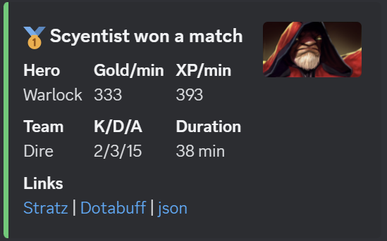

# DotA 2 match summary poster
Posts whether a player won or lost their last DotA match to Discord.  
This is achieved using [Discord channel webhooks](https://support.discord.com/hc/en-us/articles/228383668-Intro-to-Webhooks).  
Match information is read from [Open Dota API](https://docs.opendota.com).  



## Setup
1. Make a copy of `example.players.json` and rename it to `players.json`

2. Make a copy of `example.env` and rename it to `.env`

3. Enter the player Ids you want to report on in the `players.json` file.  
    The exact json in this file is not important, only the `id` property is read.  
    e.g. if your Id is 12345678:
    ```json
    [
        {
            "id": 123456789,
            "notes": "My account"
        }
    ]
    ```

4. Enter your Discord webhook url into the `.env` file
If you want to run it just locally to test or tweak, this step can be omitted by settings `POST_TO_DISCORD=false` in the `.env` file.  

## Building / Running
Build the project with 
```
npm run build
```
Run without building using
```
npm run poster
```
If you want the script to post about the last match, even if it has been posted about before, you can set `SKIP_MATCH_ALREADY_POSTED_CHECK=true` in the `.env` file.  

## Notes
The base URL for images is `https://cdn.cloudflare.steamstatic.com`.  
e.g.
```
https://cdn.cloudflare.steamstatic.com/apps/dota2/images/dota_react/heroes/antimage.png
```

The hero data constants are from the [dotaconstants repository](https://github.com/odota/dotaconstants) by [odota](https://github.com/odota).  

Matches older than 2 hours are not reported on.  
This is to avoid sending notifications about stale data if the script hasn't run in a while.  

This script can be set up to run on a schedule using something like a Raspberry Pi and a cron job.  